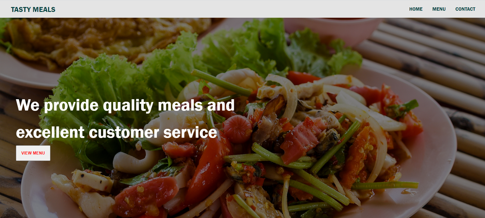

# Javascript Restuarant

> This is part of the Restuarant Project in [The Odin Project's](https://www.theodinproject.com/courses/javascript/lessons/restaurant-page?ref=lnav) Javascript Curriculum.

> A restaurant web page generated by using JavaScript to manipulate the DOM by simply rendering elements on the page.

 View the app live [here](https://taiwocoker.github.io/JavaScript_Tic-Tac-Toe/)
 
## Prerequisites

- Node
- Npm

## Setup
- git clone https://github.com/taiwocoker/Restuarant.git
- cd Restaurant-page
- run npm install
- run npm run build
- Open the dist/index.html file in any web browser of your choosing.

## Author

👤 **Taiwo Coker**

- Github: [@githubhandle](https://github.com/taiwocoker)
- Twitter: [@twitterhandle](https://twitter.com/SelloCoker)
- Linkedin: [linkedin](https://linkedin.com/in/taiwo-coker)

## 🤝 Contributing

Contributions, issues and feature requests are welcome!

Feel free to check the [issues page](https://github.com/taiwocoker/Restuarant/issues).

## Show your support

Give a ⭐️ if you like this project!

